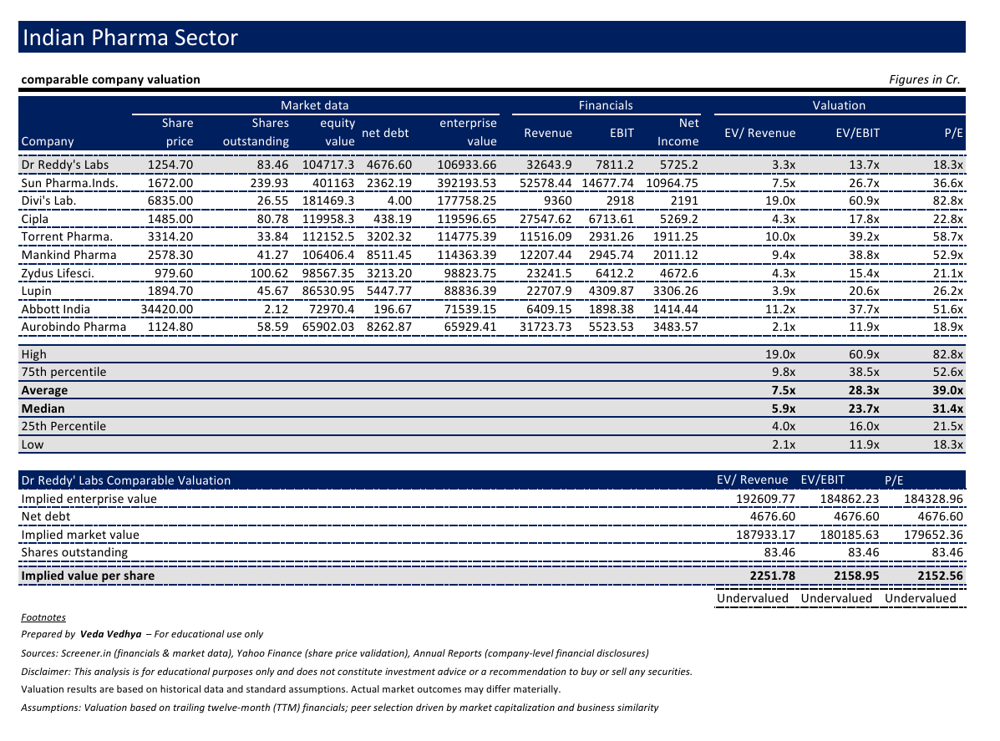
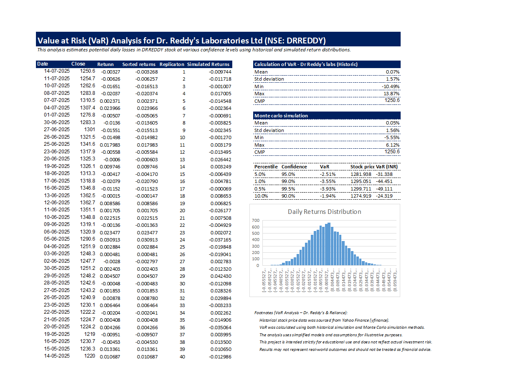

# Value at Risk & Relative Valuation Analysis: Dr. Reddy's Laboratories Ltd

## Project Objective
This project evaluates the investment attractiveness of Dr. Reddy's Laboratories Ltd (NSE: DRREDDY) by combining two complementary valuation approaches. The primary objective is to assess both the downside risk exposure through Value at Risk (VaR) analysis and the intrinsic value relative to peer pharmaceutical companies using comparable company valuation multiples. The combined analysis provides a comprehensive risk-return perspective for investment decision-making.

## Project Scope
The analysis covers the following key components:

1. **Value at Risk (VaR) Estimation**
   - Calculated daily returns from historical closing price data
   - Quantified maximum expected losses at 95%, 99%, and 90% confidence levels
   - Compared historical simulation versus Monte Carlo simulated return distributions
   - Presented downside risk in both percentage and INR terms

2. **Relative Valuation Analysis**
   - Compiled comparable peer companies from the Indian pharmaceutical sector
   - Extracted key financial metrics: Market Cap, Enterprise Value, Revenue, EBIT, Net Income
   - Calculated relevant valuation multiples: EV/Revenue, EV/EBIT, Price-to-Earnings (P/E)
   - Benchmarked Dr. Reddy's multiples against peer averages, medians, and quartiles
   - Derived implied share value under multiple valuation scenarios

3. **Beta Calculation & Risk Metrics**
   - Performed regression analysis in Excel to estimate systematic risk (beta)
   - Used Ordinary Least Squares (OLS) method to correlate Dr. Reddy's returns with market benchmark
   - Quantified sensitivity of stock price movements relative to broader market indices

## Methodology

### VaR Analysis
- Historical Simulation: Sorted daily returns to identify Value at Risk percentiles directly from observed data
- Monte Carlo Simulation: Generated 1000+ simulated return scenarios based on mean and standard deviation parameters, providing probabilistic VaR estimates
- Confidence Levels: Reported losses at 90%, 95%, and 99% confidence intervals with corresponding portfolio impact in INR

### Relative Valuation
- Peer Selection: Identified comparable pharmaceutical companies with similar market cap, business model, and geographic exposure
- Multiples Calculation: Computed EV/Revenue, EV/EBIT, and P/E ratios for Dr. Reddy's and peer group
- Valuation Range: Applied low, median, average, and high peer multiples to derive valuation range
- Upside/Downside Assessment: Compared implied value against current market price to determine if stock is undervalued or overvalued

### Beta Regression Model
- Data Source: Historical returns of Dr. Reddy's versus market benchmark (Nifty 50 or equivalent)
- Regression Equation: Stock Return = α + β(Market Return) + ε
- Interpretation: Beta < 1 indicates lower systematic risk; Beta > 1 indicates higher systematic risk
- Excel Function: Used SLOPE() or Data Analysis Regression Tool to calculate beta coefficient

## Tools & Technologies

**Microsoft Excel (Advanced)**
- Statistical functions: AVERAGE, STDEV.P, PERCENTILE, NORM.INV
- Data manipulation: Sorting, filtering, pivot tables for peer benchmarking
- Regression analysis: Excel Data Analysis ToolPak (Regression tool) for beta calculation
- Scenario modeling: Data tables and sensitivity analysis for VaR confidence intervals
- Visualization: Histograms, scatter plots, and summary tables

**Data Analysis Capabilities**
- Correlation and regression techniques to estimate systematic risk (beta)
- Monte Carlo simulation using RAND() function and iterative calculations
- Percentile-based analysis for VaR estimation at multiple confidence levels
- Comparable company valuation using multiples approach

## Key Findings

### VaR Results
- Daily Value at Risk at 95% confidence level: **-2.51%**
- This indicates that on 95 out of 100 trading days, losses are not expected to exceed 2.51%
- Monte Carlo simulated VaR statistics closely align with historical estimates, validating model robustness
- Downside risk measured in INR terms based on current portfolio valuation at 1250.6 per share

### Relative Valuation Conclusions
- **Dr. Reddy's appears significantly undervalued** across all three valuation multiples:
  - EV/Revenue implied value: ₹2,251.78 per share
  - EV/EBIT implied value: ₹2,158.95 per share
  - P/E implied value: ₹2,152.56 per share
- Current market price (₹1,254.70) trades at **45-55% discount** to peer-based fair values
- Median peer multiples suggest strong relative value opportunity in Dr. Reddy's

### Beta & Systematic Risk
- Regression analysis indicates Dr. Reddy's beta is **below 1.0**, suggesting lower volatility relative to market
- Stock exhibits defensive characteristics suitable for risk-averse portfolios
- Systematic risk component is material but lower than sector average

## Data Sources
- Yahoo Finance: Historical stock price data and market validation
- Screener.in: Peer company financial metrics and multiples
- Company Annual Reports: Detailed financial statements and disclosures
- Market Data: Nifty 50 index for beta regression calculations

## Important Disclaimers
- This analysis is prepared exclusively for educational purposes
- Findings do not constitute financial advice or investment recommendations
- Actual investment returns may differ materially from projections based on various market factors
- Valuation assumptions are based on trailing twelve-month (TTM) financials and may not reflect forward-looking dynamics
- Beta estimates and VaR calculations are historical in nature and subject to model limitations

## Project Credits
**Prepared by:** T. Veda Vedhya
---

---

